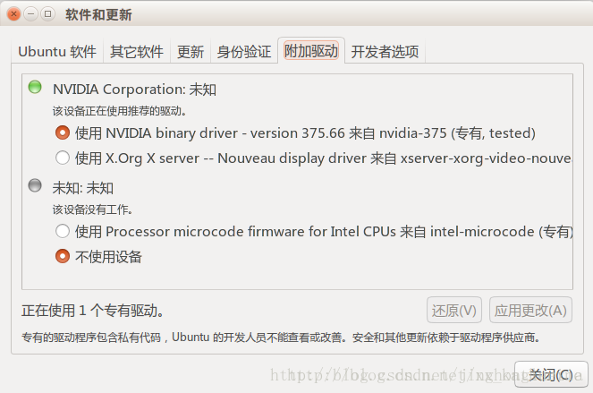

# 1 引言
## 1.1 目的和范围
从零开始Ubuntu 16.04 + CUDA 9.0 + CUDNN 7.0 深度学习环境搭建

## 1.2 文档约定


# 2 具体步骤
## 2.1 更新apt源
```bash
sudo cp /etc/apt/sources.list /etc/apt/sources.list.bak #备份是好习惯
sudo vim /etc/apt/sources.list                          #打开apt source文件
```
删光，粘贴以下代码
```bash
deb https://mirrors.tuna.tsinghua.edu.cn/ubuntu/ xenial main restricted universe multiverse
deb-src https://mirrors.tuna.tsinghua.edu.cn/ubuntu/ xenial main restricted universe multiverse
deb https://mirrors.tuna.tsinghua.edu.cn/ubuntu/ xenial-updates main restricted universe multiverse
deb-src https://mirrors.tuna.tsinghua.edu.cn/ubuntu/ xenial-updates main restricted universe multiverse
deb https://mirrors.tuna.tsinghua.edu.cn/ubuntu/ xenial-backports main restricted universe multiverse
deb-src https://mirrors.tuna.tsinghua.edu.cn/ubuntu/ xenial-backports main restricted universe multiverse
deb https://mirrors.tuna.tsinghua.edu.cn/ubuntu/ xenial-security main restricted universe multiverse
deb-src https://mirrors.tuna.tsinghua.edu.cn/ubuntu/ xenial-security main restricted universe multiverse
# 预发布软件源，不建议启用
# deb https://mirrors.tuna.tsinghua.edu.cn/ubuntu/ xenial-proposed main restricted universe multiverse
# deb-src https://mirrors.tuna.tsinghua.edu.cn/ubuntu/ xenial-proposed main restricted universe multiverse
```
保存并退出
```bash
sudo apt-get update
sudo apt-get upgrade
```
更新一下软件和库，然后装一些常用的东西比如gcc之类的
## 2.2 安装显卡驱动
首先要知道自己的显卡型号，并去NVIDIA官方网站找到对应的驱动，如果不知道的话用下面的命令查看显卡型号，如果依然看不到什么型号，去找相应系列的稳定版驱动，有以下几种方式可以安装驱动。
```bash
lspci|grep NVIDIA
```
- 系统软件更新：系统设置->软件更新->附加驱动->选择nvidia最新驱动(361)->应用更改
<p align="center">
    
    <br>
    <div align="center">Fig 1 Ubantu软件与更新</div>
</p>

- 使用第三方源安装
```bash
sudo add-apt-repository ppa:graphics-drivers/ppa
sudo apt-get update
#添加第三方仓库并更新源
sudo apt-get remove --purge nvidia*
#卸载老版驱动
sudo apt-cache search nvidia-*
#查看ppa安装支持的驱动版本，如果有要找的驱动
sudo apt-get install nvidia-#
#直接安装，其中#是对应的版本号
```
- 直接在[NVIDIA官网](https://www.nvidia.cn/Download/index.aspx?lang=cn)下载对应驱动的 .run 文件
```bash
wget "link-to-driver"
#下载下来之后
sudo chmod 777 driver.run
#改权限
sudo ./driver.run --uninstall
#卸载掉之前的旧驱动
sudo ./driver.run
#直接运行，这里可能会报两个错，一个是kernel的问题，一个是linux头文件的问题
sudo apt-get install linux-headers-$(uname -r)
sudo apt-get install gcc build-essential
#安装头文件和build-essential解决，后面的一路选是就好了。
#如果是桌面版的ubuntu（有图形界面），在这样安装完显卡驱动之后可能会出现显示分辨率有问题的bug，是因为NVIDIA驱动与X config不兼容的问题。
#解决方法：ctrl + alt + f1 进入tty模式，登录之后
sudo ./driver.run --uninstall
#卸载掉驱动
sudo service lightdm stop
#关闭图形服务
sudo ./driver.run --no-x-check --no-nouveau-check --no-opengl-files
#在安装驱动时关掉X config，关掉默认驱动nouveau，不安装opengl文件，然后一路选是，在变更Xconfig的时候选择否
sudo service lightdm start
#开启图形服务
```
最后运行以下命令测试测试，如果能看到显卡状态，说明安装成功

```bash
nvidia-smi
```
## 2.3 安装CUDA
从[官网](https://developer.nvidia.com/cuda-downloads)下载CUDA对应版本和对应操作系统的runfile(local)，右键复制链接地址
```bash
wget "link-to-cuda"
#下载下来之后
sudo chmod 777 cuda.run
#更改权限
sudo ./cuda.run
#开始安装，一路选是，除了第二个问题，问是否要安装某某版本的显卡驱动，选否，因为上面我们已经安装过了，安装完成之后
vim ~/.bashrc
#给单个用户或者
sudo vim /etc/profile
#给所有用户添加环境变量
export PATH=/usr/local/cuda/bin:$PATH
export LD_LIBRARY_PATH=/usr/local/cuda/lib64:$LD_LIBRARY_PATH
#保存并退出
source ~/.bashrc
#或者
source /etc/profile
#使环境变量生效
echo $PATH
echo $LD_LIBRARY_PATH
nvcc -V
#检查是否安装完成
```

## 2.4 安装cudnn
从[NVIDIA官网](https://developer.nvidia.com/cudnn)下载CUDA版本对应的cudnn
```bash
tar -zxvf cudnn.tgz
#得到一个 cuda 文件夹
sudo cp ./cuda/include/cudnn.h /usr/local/cuda/include
sudo cp ./cuda/lib64/libcudnn* /usr/local/cuda/lib64
#将其中的文件copy到cuda的安装路径
sudo chmod 777 /usr/local/cuda/include/cudnn.h
sudo chmod 777 /usr/local/cuda/lib64/libcudnn*
#更改权限为777
```

## 2.5 安装anaconda
[官网](https://www.anaconda.com/distribution/)复制下载链接
```bash
wget "link-to-anaconda"
#下载下来之后
sudo chmod 777 Anaconda.sh
#更改权限
sudo bash ./Anaconda.sh
#运行，一路选是，安装路径推荐 /opt/anaconda2 方便其他用户使用
vim ~/.bashrc
#给单个用户或者
sudo vim /etc/profile
#给所有用户添加环境变量
export PATH=/opt/anaconda:$PATH
#保存并退出
source ~/.bashrc
#或者
source /etc/profile
#使环境变量生效
```

## 2.6 使用pip安装python包
```bash
#首先更换pip源为国内源
cd ~
mkdir .pip
cd .pip
vim pip.conf
#添加以下代码
[global]
index-url=https://pypi.tuna.tsinghua.edu.cn/simple
#保存并退出
#在使用pip安装时，常需要使用sudo权限，但是直接sudo pip会出现路径不一致的问题，首先
which pip
#找到使用的pip路径（以/opt/anaconda2/bin/pip为例）
sudo /opt/anaconda2/bin/pip install package_name
sudo /opt/anaconda2/bin/pip uninstall package_name
sudo /opt/anaconda2/bin/pip install package_name==#.#.#
#分别对应安装，卸载和安装制定版本的包（#.#.#为包的版本）
#常用的包（除anaconda自带的以外）
opencv-python, vtk, SimpleITK, tqdm, pydicom, tensorflow-gpu, keras, torch
```
