# 1 引言
## 1.1 目的和范围
自由度极高的构建方式（编写groovy，shell脚本）   
多git，参数化，并行构建，多节点构建

## 1.2 文档约定


# 2 安装Jenkins
## 2.1 服务器端
```bash
# 1.下载离线安装包
wget   
# 2. 解压

# 3. 

```


# 3 使用Jenkins
## 3.1 创建节点
### 3.1.1 配置服务端
1. 新建节点   
依次点击jenkins → 系统管理→节点管理   
<p align="center">
    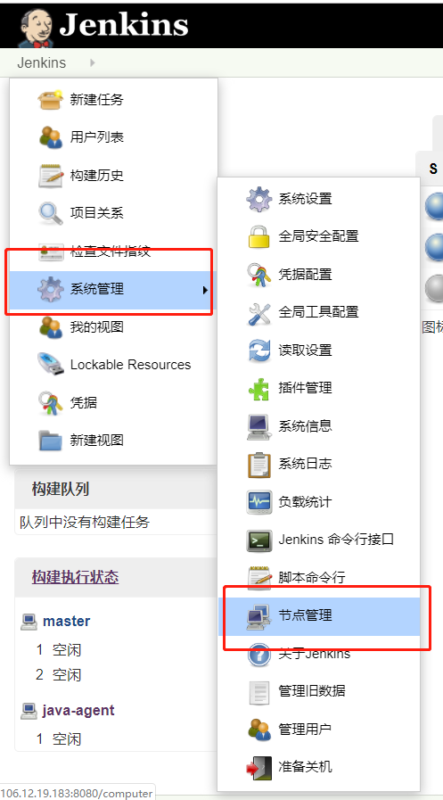
</p>

从而进入新建节点页面 
依次点击jenkins → 系统管理→节点管理   
<p align="center">
    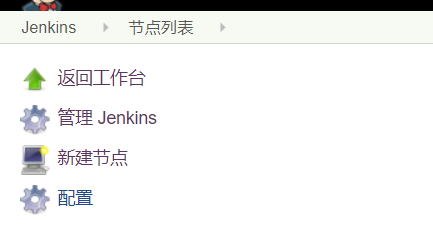
</p>

2. 设置节点   
节点名称很重要，后期的pipeline编写会用到节点名称，例如此处填写java-agent2（备注：3.1.2章节配置的是alpha-agent），选择固定节点
<p align="center">
    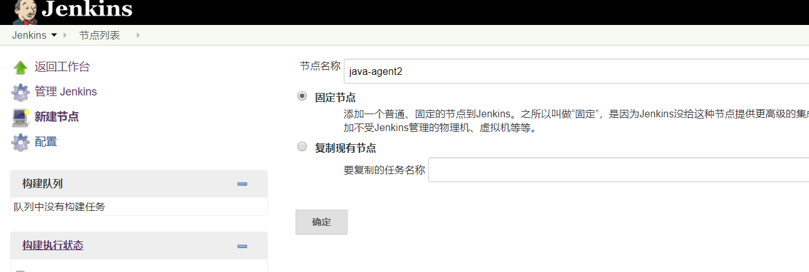
</p>
点击确定后，进入节点配置页面

<p align="center">
    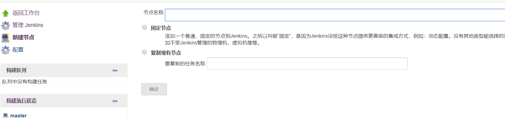
</p>

<p align="center">
    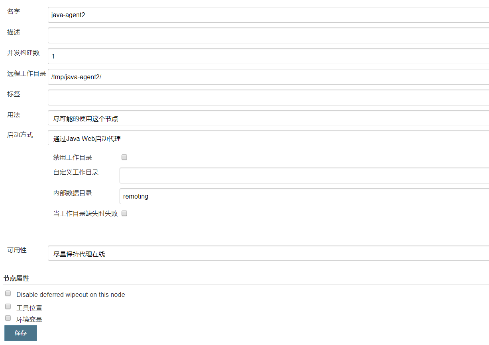
</p>

远程工作目录：jenkins从节点的工作目录

3. 获取节点信息   
点击查看系统信息：
<p align="center">
    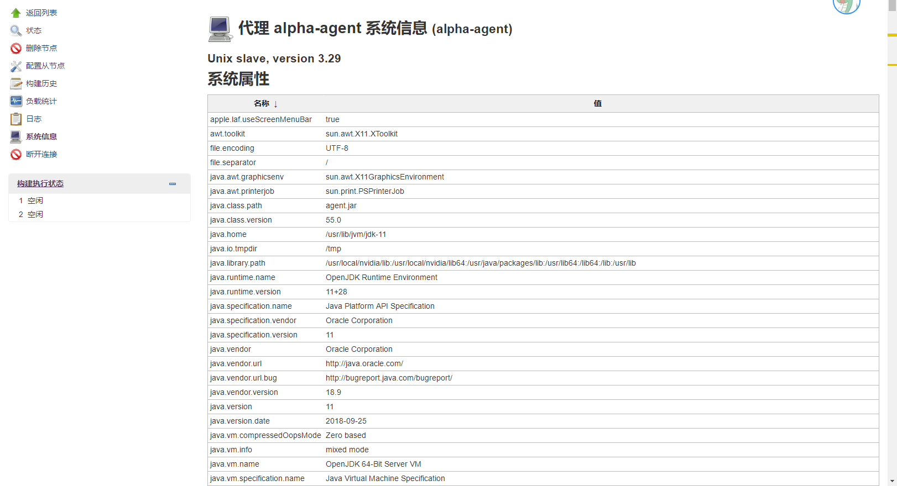
</p>

往下拉，获取“JENKENS_SECRET”信息，便于后续远端节点通信。
<p align="center">
    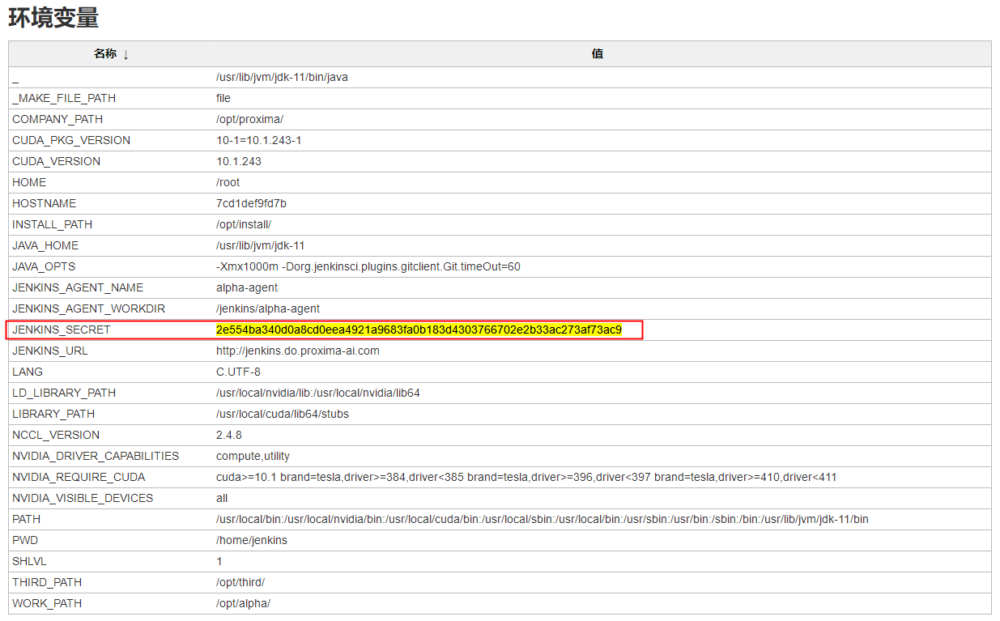
</p>


### 3.1.2 配置远端节点

```bash
# 1. 找一个服务器（可以直接和jenkins服务器通信）;
# 2. 创建环境：建议直接使用docker镜像，方便进行环境管理，Dockerfile参考“/demo/alpha/Dockerfile”;
# 3. 运行环境：配置docker-compose.yml文件，注意以下环境变量的设置（JENKINS_SECRET）,启动之后，容器直接和jeckins服务器获取连接（刷新jeckins网页，可以发现节点列表alpha-agent成功）
environment:
    JENKINS_URL: http://jenkins.do.proxima-ai.com
    JENKINS_SECRET: 2e554ba340d0a8cd0eea4921a9683fa0b183d4303766702e2b33ac273af73ac9
    JENKINS_AGENT_NAME: alpha-agent
    JENKINS_AGENT_WORKDIR: /jenkins/alpha-agent
    JAVA_OPTS: "-Xmx1000m -Dorg.jenkinsci.plugins.gitclient.Git.timeOut=60"
```

## 3.2 创建任务
### 3.2.1 创建JenkinsFile
1. 创建新任务   
<p align="center">
    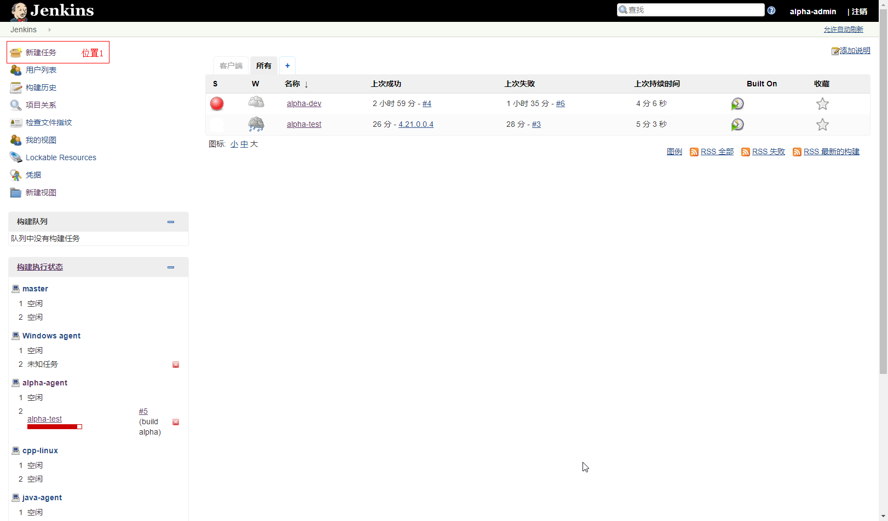
</p>
使用pipeline模式
<p align="center">
    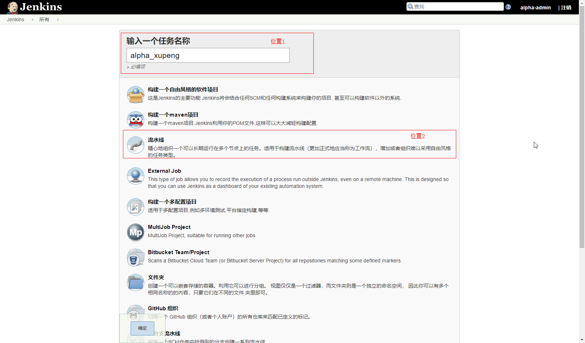
</p>
完成后，进入任务：
<p align="center">
    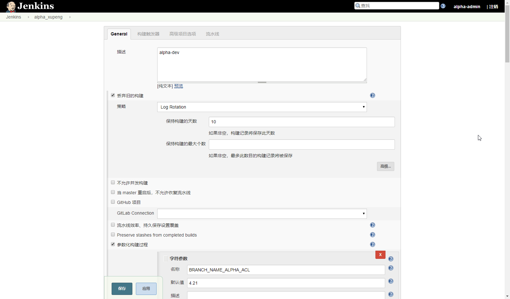
</p>

2. 构建jenkinsfile
```bash
# 1. 创建文件，参考文件“demo/Jenkinsfile-alpha-test”
# 2. 在“stages”里面创建流程
```

### 3.2.2 配置界面参数
```bash
# 将jenkinsfile中用的变量用界面显示
```
<p align="center">
    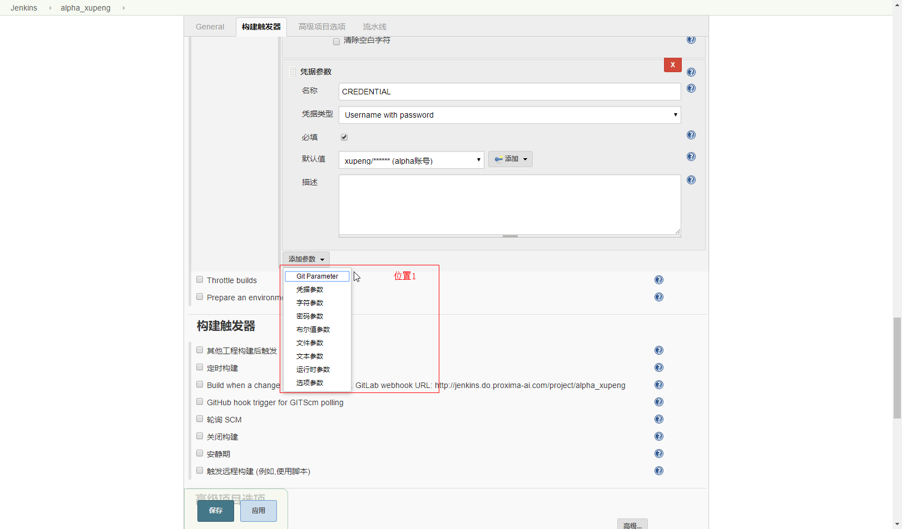
</p>


<p align="center">
    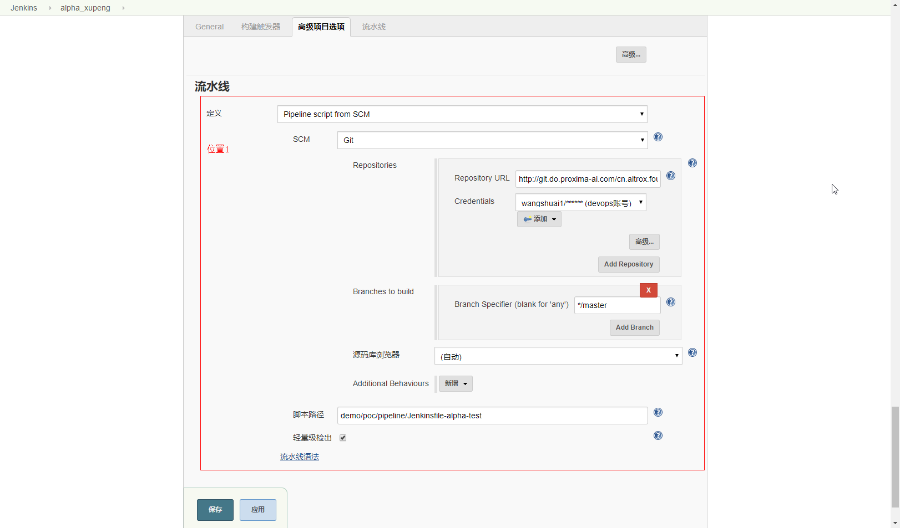
</p>

### 3.2.3 运行任务
<p align="center">
    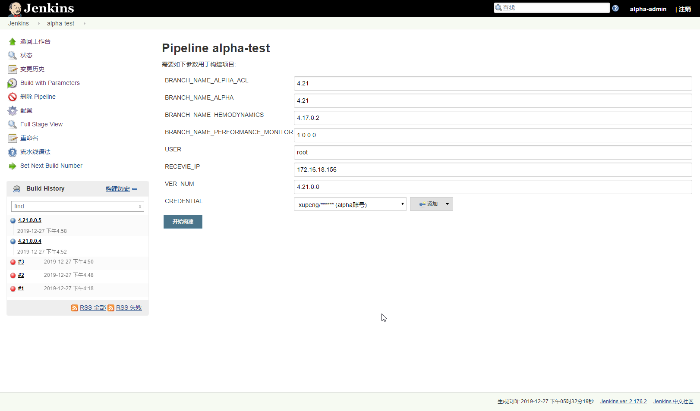
</p>


