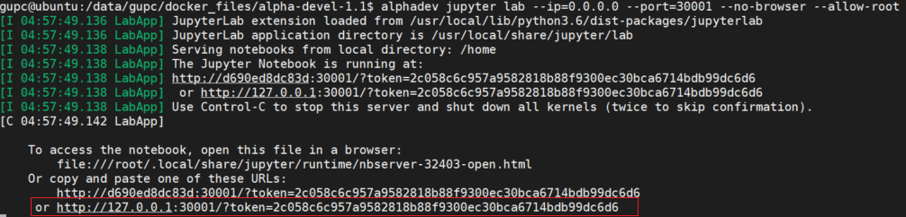

# 1 引言
## 1.1 目的和范围


## 1.2 文档约定


# 2 具体步骤
## 2.1 启动jupyter-lab

开启指令：
```bash
jupyter lab --ip=0.0.0.0 --port=<your_jupyter_port> --no-browser --allow-root
```

把生成的URL（上述图中红框）复制到浏览器，把127.0.0.1换成服务器IP。   
<p align="center">
    
</p>
