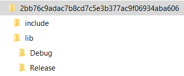

# 1 引言
## 1.1 目的和范围
- C++程序的依赖管理是一个由来已久的问题, 仅在Windows上就有程序就有Visual Studio, MinGW等多种编译器, 即使是Visual Studio下编译的结果的也有x86,x86_x64程序之分, 针对运行和调试环境有Debug和Release2种配置, 还有MD和MT这样的动态库依赖方式之分, 如果加上Linux环境, 仅仅针对一个库就可能产生多种编译结果, 开发团队为了自己需要会针对不同配置把一种库编译多次, 库文件的存储和管理都成问题. 为了简化依赖库的管理, 保证基于C++语言的第三方库以及公司开发的各种基础库能在Windows和Linux环境下方便使用, 迫切需要一种好的依赖管理方式, 从而保证我们简化开发环境和依赖管理方式, 并为Devops打下基础.
- Conan是一个开源，分布式和多平台包管理器，用于创建和共享所有C++二进制包文件, 经过初步调研, 认为可以满足我们目前的需求。

## 1.2 文档约定


# 2 安装conan环境
Conan的使用需基于Python, 安装方式很简单: 
```bash
pip install conan
```

# 3 创建conan包
## 3.1 将远端conan服务器加入本地列表
```bash
conan remote add <server_name> <sever_url>
```
## 3.2 在conan上搜索包
```bash
conan search <name>                    #本地搜索
conan search <name> -r <server_name>   #服务器搜索
conan search --remote <server_name>    #查看全部安装包
```
## 3.3 创建一个包路径, 并conan包结构
```bash
conan new <name> --bare
# 如 conan new mylib/0.1@imaging/dev --bare, conan会自动创建默认的conanfile.py文件
```
## 3.4 打包已经编译好的第三方库到conan
1. conan包名定义: name/version@user/channel (user和channel 是可选的), 例如VTK/8.2.0@imaging/dev
2. 使用conan的根本目的在于我们希望第三方库只编译一次就可以给所有人使用, 所以首先需要编译好我们需要的库。以VTK为例, 准备编译好的库文件以以上文件结构排布, include目录包含所有头文件, lib下包括了Debug和Release的静态库
<p align="center">
    
    <br>
    <div align="center">Fig 1</div>
</p>

3. 下面在主目录中创建“conanfile.py”文件：在该文件中定义了库相关信息和该库所包含的头文件, 库文件或bin文件的组织方式, 打包时即可应用.
```python
from conans import ConanFile, CMake, tools
import os, fnmatch
 
class VTKConan(ConanFile):
    # 库基本信息
    name = "VTK"
    version = "8.2.0"
    license = "BSD license"
    author = "Kitware"
    url = "https://vtk.org/"
    topics = ("Visualization")
    # 定义需要的库设置
    settings = "os", "compiler", "build_type", "arch"
    description = "Visualization Toolkit"
     
    def package(self):
        # 打包时拷贝所有文件
        self.copy("*")
 
    def package_info(self):
        # 头文件和库文件目录及库文件定义
        self.cpp_info.includedirs=["include"]
        self.cpp_info.release.libdirs=["lib/Release"]
        self.cpp_info.debug.libdirs=['lib/Debug']
        self.cpp_info.release.libs = fnmatch.filter(os.listdir('lib/Release'), '*.lib')
        self.cpp_info.debug.libs = fnmatch.filter(os.listdir('lib/Debug'), '*.lib')
        self.cpp_info.libdirs = ['lib']  # Directories where libraries can be found
        self.cpp_info.resdirs = ['res']  # Directories where resources, data, etc can be found
        self.cpp_info.bindirs = ['bin']  # Directories where executables and shared libs can be found
        self.cpp_info.srcdirs = []  # Directories where sources can be found (debugging, reusing sources)
        self.cpp_info.defines = []  # preprocessor definitions
        self.cpp_info.cflags = []  # pure C flags
        self.cpp_info.cxxflags = []  # C++ compilation flags
        self.cpp_info.sharedlinkflags = []  # linker flags
        self.cpp_info.exelinkflags = []  # linker flags
```
4. 下面可以打包库了, 运行以下代码，运行该命令执行打包, 打包时执行了相应的arch和os, 因此针对同一个包可以打针对不同的操作系统和架构的包, 执行成功则该库已经成功打包到本地缓存中
```bash
conan export-pkg .  VTK/8.2.0@imaging/stable -s arch=x86 -s os=Windows
```
5. 上传库文件到服务器
```bash
conan upload <name> -r <server_name>   --all –force
```

# 4 使用conan包
# 4.1 编写conanfile.txt
该文件描述了当前项目需要何种conan包以及使用何种方式, 以下是一个Windows下Visual Studio的例子。该文件描述了当前项目依赖于vtk, 并且使用Visual Studio。
```bash
[requires]
VTK/8.2.0@imaging/stable
 
[generators]
visual_studio    # 生成vs工程
cmake            # cmake用于cmake工程

[imports]
bin, *.dll -> ./bin # Copies all dll files from packages bin folder to my local "bin" folder
lib, *.dylib* -> ./bin # Copies all dylib files from packages lib folder to my local "bin" folder
```
## 4.2 下载和使用依赖库
运行以下代码，则会根据指定的设置自动查找和下载相应的依赖库, 并生成conanbuildinfo.props, 在Visual Studio工程中的property manager里面加入该props文件, 则完成了对第三方库的依赖, 基本可以进行正常编译.
```bash
conan install . -s arch=x86 -s os=Windows -r local  --update
```
## 4.3 CMake集成
对于跨平台的应用或者在Linux下的应用, 我们需要使用CMake编译, 这种情况下conanfile.txt的写法如下:
```bash
[requires]
VTK/8.2.0@imaging/stable
 
[generators]
cmake
```
在CMakeList.txt的写法如下:
```bash
cmake_minimum_required(VERSION  2.8.12)
project(RemoteVTKTest)
 
include(${CMAKE_BINARY_DIR}/conanbuildinfo.cmake)
conan_basic_setup()
 
link_directories(${CONAN_LIB_DIRS_DEBUG})
 
add_executable(RemoteVTKTest  main.cpp)
 
foreach(_LIB  ${CONAN_LIBS_RELEASE})
        target_link_libraries(RemoteVTKTest  optimized  ${_LIB})
endforeach()
foreach(_LIB  ${CONAN_LIBS_DEBUG})
        target_link_libraries(RemoteVTKTest  debug  ${_LIB})
endforeach()
target_link_libraries(RemoteVTKTest  Dbghelp.lib  kernel32.lib  user32.lib  gdi32.lib  winspool.lib  shell32.lib  ole32.lib  oleaut32.lib  uuid.lib  comdlg32.lib  advapi32.lib  vfw32.lib  glu32.lib  opengl32.lib  comctl32.lib  wsock32.lib  ws2_32.lib  Psapi.lib)
```
可以看到, cmake里只包含了对conanbuildinfo.cmake的引用。同样运行conan install, 会生成conanbuildinfo.cmake, 运行cmake生成对应的工程, 代码即可正常编译.


# 5 参考资料
1. [conan官网](https://docs.conan.io/en/latest/)
