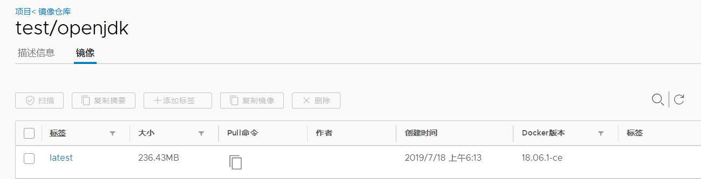

# 1 引言
## 1.1 目的和范围
镜像文件docker images管理
## 1.2 文档约定


# 2 安装Harbor环境
## 2.1 服务器端
```bash
# 1.下载离线安装包
wget   https://storage.googleapis.com/harbor-releases/release-1.8.0/harbor-offline-installer-v1.8.1.tgz
# 2. 解压
tar xvf harbor-offline-installer-v1.8.1.tgz
# 3. 按需修改 harbor.yml
# 4. 执行 sh prepare, 会生成一个docker-compose文件，对这个文件进行按需修改
# 5. 执行docker-compose up -d 即可启动harbor

参考：https://github.com/goharbor/harbor/blob/master/docs/installation_guide.md
```

## 2.2 客户端

# 3 使用脚本
## 3.1 登录Harbor
```bash
# 1. 添加私服地址（insecure-registries参数）
vim /etc/docker/daemon.json #添加如下参数
{"insecure-registries" : ["<harbor server url>"],}
# {"insecure-registries" : ["harbor.do.proxima-ai.com"],}

# 2. docker重启
service docker restart

# 3. 账号登录
docker login -u <user_name> -p <password> <harbor server url> 
# docker login -u test -p Test987654 http://harbor.do.proxima-ai.com
# docker login -u alpha -p Alpha987654 http://harbor.do.proxima-ai.com

```

## 3.2 推送镜像
推送镜像至私服前，需要先给镜像打上标签，打标签格式为   
```bash
docker tag 镜像名:标签 私服地址/仓库项目名/镜像名:标签   
docker tag docker.io/openjdk:latest  harbor.do.proxima-ai.com/test/openjdk:latest
#将原来为docker.io/openjdk:latest的镜像打标签为 harbor.do.proxima-ai.com/test/openjdk:latest   
```

<p align="center">
    
</p>

执行docker push harbor.do.proxima-ai.com/test/openjdk:latest命令后，harbor.do.proxima-ai.com/test/openjdk:latest镜像会被推送至test仓库里。   
<p align="center">
    
</p>

登录harbor即可看到   
<p align="center">
    
</p>

## 3.3 拉取私服镜像
docker pull  harbor.do.proxima-ai.com/test/openjdk:latest   
<p align="center">
    
</p>

## 3.4 删除镜像
在harbor页面进行删除   
<p align="center">
    
</p>


