# 1 引言
## 1.1 目的和范围
将CPP的visual studio工程，在Windows 10操作系统使用Visual Studio 2017，SSH远程linux环境进行开发。

## 1.2 文档约定

# 2 环境配置
# 2.1 Linux端环境配置
1. 配置固定IP：如下图Fig1所示；

    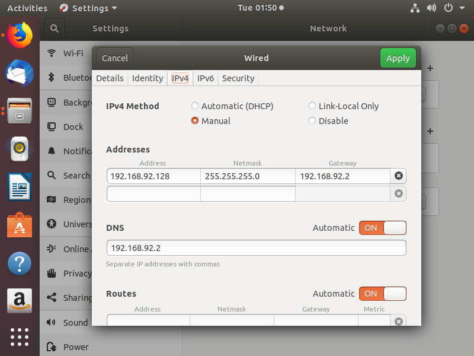
     
    
Fig 1 IP配置

2. 配置项目路径：如下图Fig2所示，建立文件夹RegLungProject；

3. 安装需要的第三方函数库：如下图Fig3所示，将所有第三方库放置在Output_linux文件夹下，库文件放置与bin或者bin_debug文件夹，头文件放置于include文件夹。

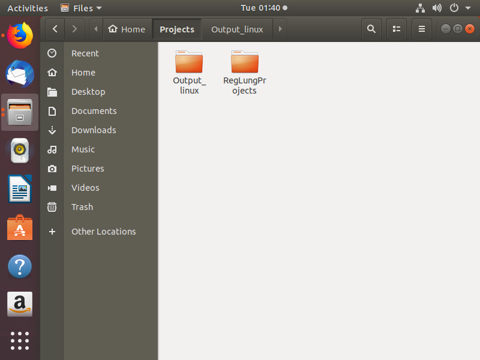 | 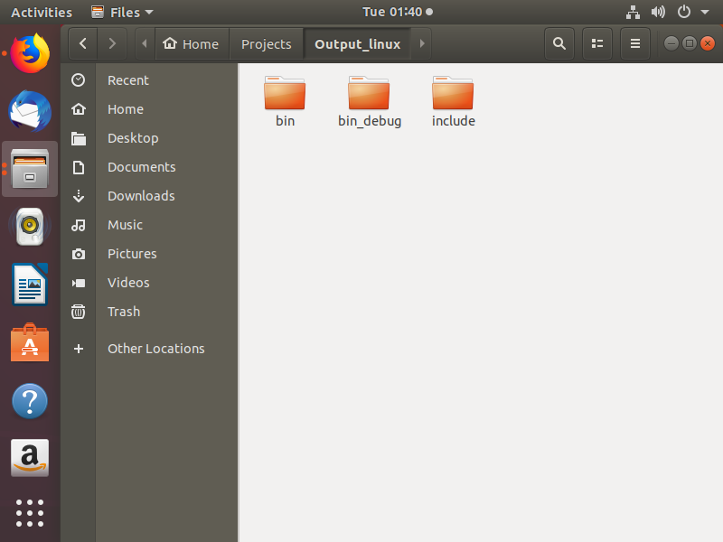 
:-: | :-: 
Fig 2 配置项目 | Fig 3 配置第三方库

# 2.2 Windows端环境配置
1. 安装Visual Studio 2017，选择“跨平台Linux”模块进行安装就可以了；
2. 添加SSH链接：工具->选项->跨平台->连接管理器。然后添加相应的SSH配置。

# 3 项目配置
# 3.1 创建Linux跨平台工程
在Windows端打开VS2017，新建项目，选择“跨平台”—>“空项目(Linux)”，设置“项目名称、路径位置、解决方案名称”，如下图Fig4所示。

    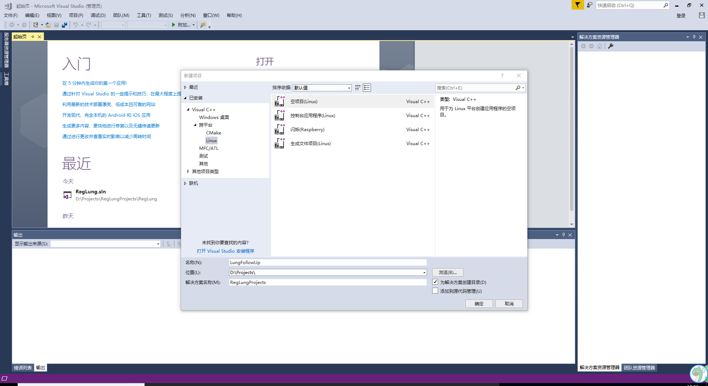
     
    
Fig 4 IP配置

# 3.2 配置项目生成状态
右键项目名称，选择“属性”，选择“所有配置”，然后：
- 在“配置属性->常规->远程生成计算机/远程生成根目录”进行Ubantu环境下的相应配置，然后确定保存 

    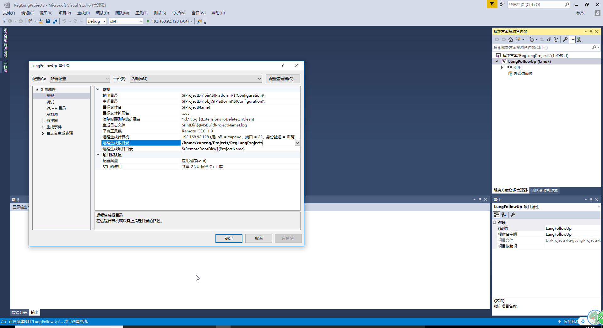
     
    
Fig 5

- 在“配置属性->常规->输出目录”进行输出目录配置，对于release和debug两个情况分开配置

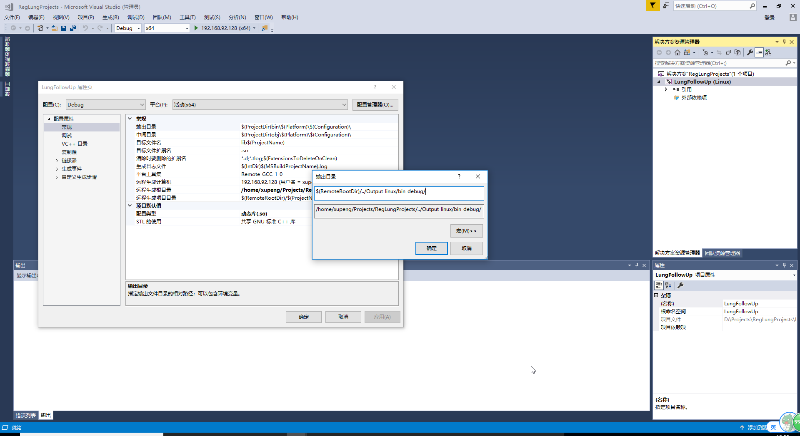 |  
:-: | :-: 
Fig 6 | Fig 7 

- 在“配置属性->项目默认值->配置类型”进行输出类型配置，如果是动态链接库，需要选择“动态库(.so)”

    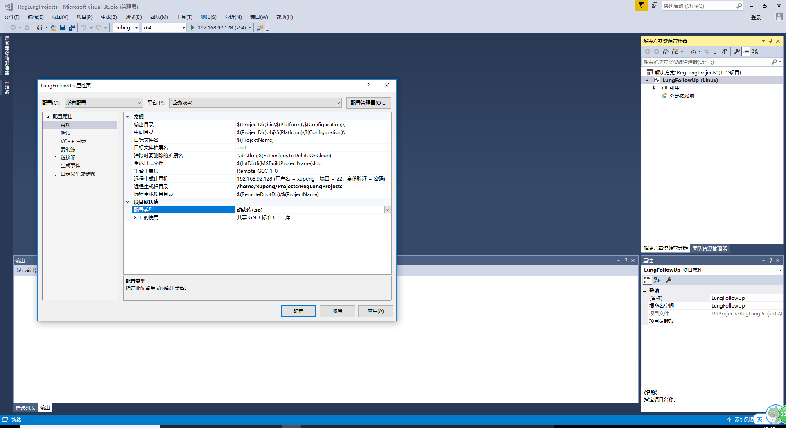
     
    
Fig 8

- 在“VC++目录->常规->包含目录”添加需要引用的头文件目录（头文件存放在windows环境下）

    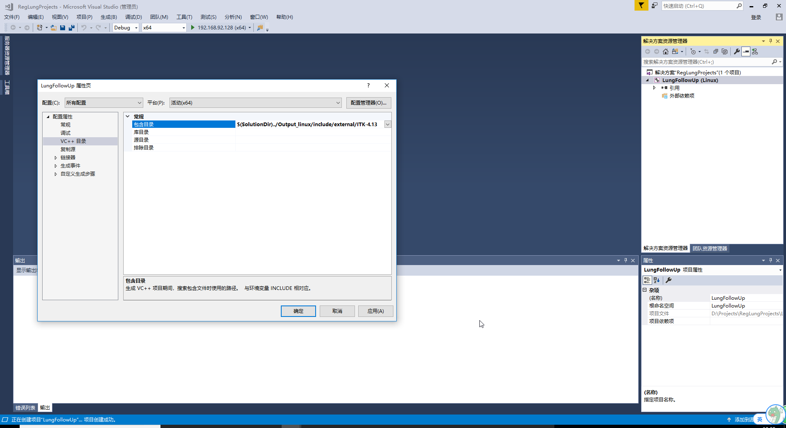
     
    
Fig 9

> 备注：windows支持linux的文件夹路径标准，所以相对路径的设置都是用斜杠“/”，而非反斜杠“\”。

# 4 项目开发
# 4.1 配置项目目录结构
在项目目录下添加筛选器“header”和“source”，分布存放头文件和源文件

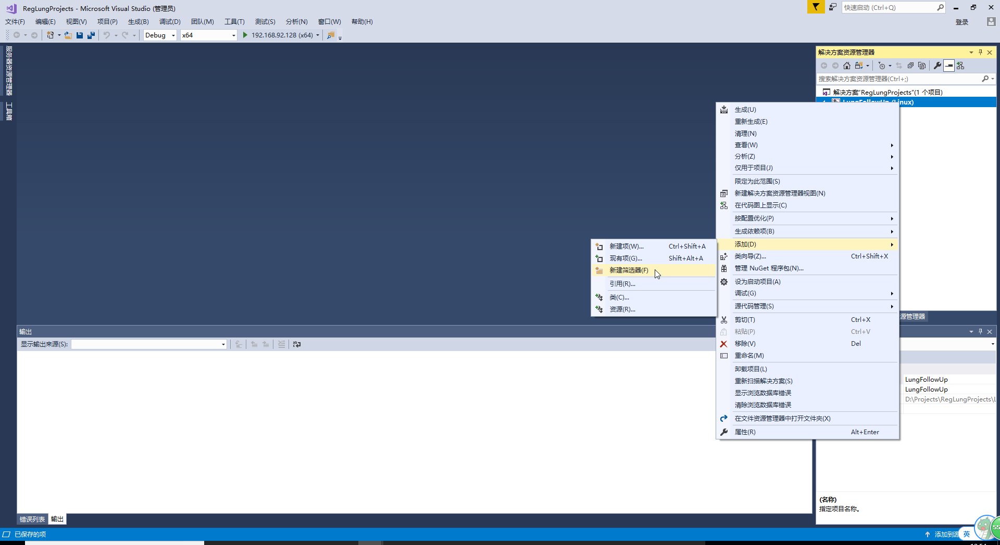 | 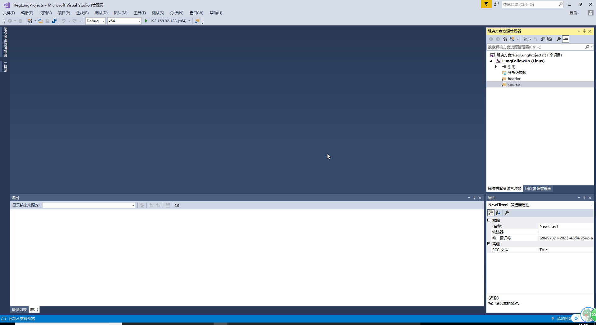 
:-: | :-: 
Fig 10 | Fig 11 

> 备注：“header”和“source”并不是关键字，可以是任意单词，只是为了方便coder自己看，系统编译的时候，完全是跟进项目文件的“配置属性”进行的。

# 4.2 新建文件或添加文件

 | 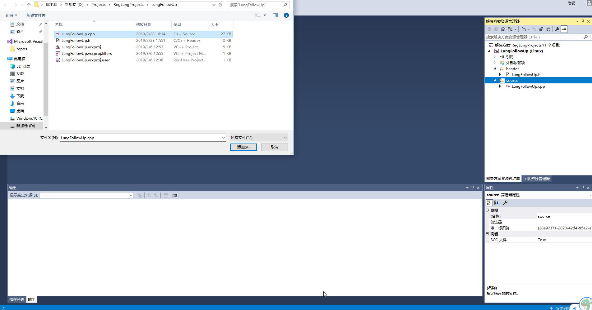 
:-: | :-: 
Fig 12 | Fig 13 

# 4.3 添加Linux头文件路径
在“配置属性 -> C/C++ -> 常规 -> 附加包含目录”，添加Linux下的头文件路径；

# 4.4 添加Linux库文件依赖
1. 在“配置属性->链接器->常规->附加库目录”针对release和debug模式分别添加目录

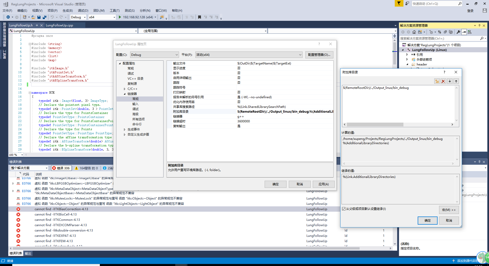 | 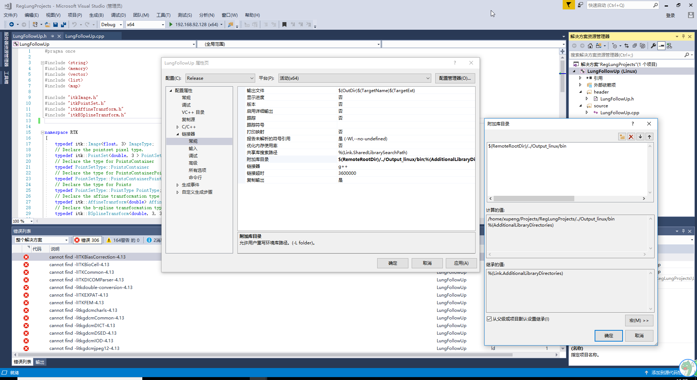 
:-: | :-: 
Fig 14 | Fig 15 

2. 在“配置属性->链接器->输入->库依赖项”添加所需的库文件名

    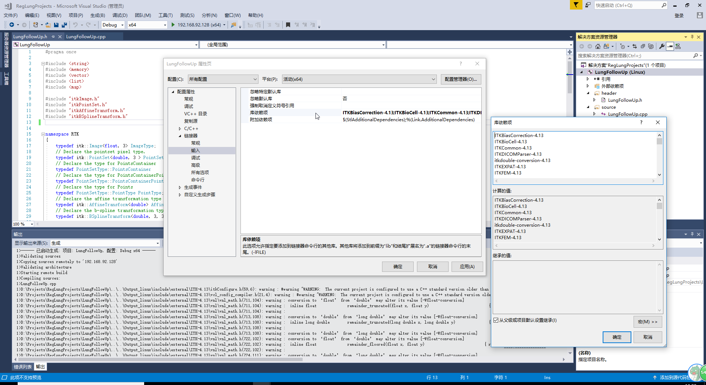
     
    
Fig 16

> 备注：需要去除文件的后缀和lib前缀。

# 4.5 项目build
右键项目名称，选择“生成”。生成之后，可以发现，在ubantu系统下，对应的输出目录下，有“.so”文件生成。

    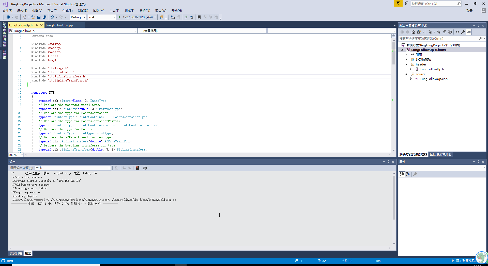
     
    
Fig 17

# 4.6 项目debug
1. 右键需要debug的项目，选择“设为启动项目”；
2. 在“配置属性->调试->程序”，配置为Linux下的程序路径；
3. 下断点，点击运行按钮即可进入调试状态。

# 5 参考文档

