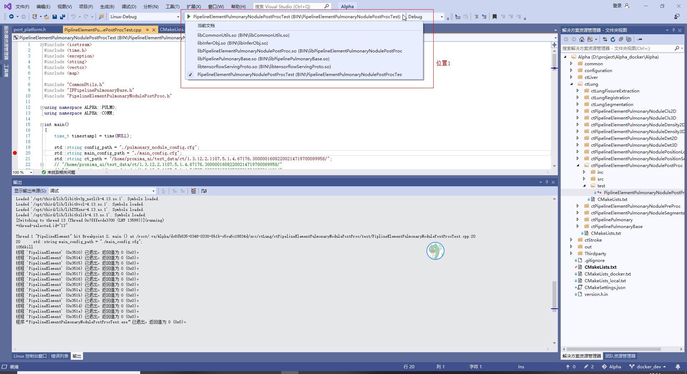
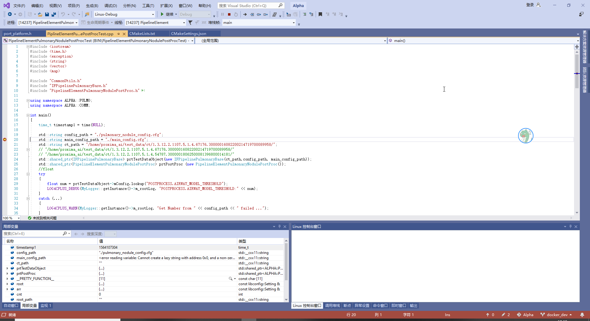

# 1 引言
## 1.1 目的和范围
将CPP的CMake工程ALPHA，在Windows 10操作系统使用Visual Studio 2019，SSH远程linux环境下docker的contanier进行开发。

## 1.2 文档约定


# 2 环境配置
## 2.1 Windows10环境下Visual Studio 2019安装
1. 官网下载[Visual Studio 2019 Community](https://visualstudio.microsoft.com/zh-hans/thank-you-downloading-visual-studio/?sku=Community&rel=16)版本；
2. 直接安装，然后打开Visual Studio Installer;
3. 选择“使用C++的Linux开发”模块进行安装;
4. 安装完，直接打开Visual Studio 2019。

## 2.2 Linux环境下SSH配置
1. 准备docker镜像：默认安装以下必备材料
  - ALPHA相关库文件和头文件；
  - ssh服务（apt-get install openssh-server）,/etc/ssh/sshd_config文件中PermitRootLogin的值为yes
  - gdb服务（apt-get install gdb gdbserver）
  - container用户root的密码：123456
2. docker-compose.yml文件配置
```bash
version: '2.4'
services:
  cpp_build_env:
    image: cpp_build_env:1.0
    restart: always
    environment:
      - LANG=C.UTF-8
    ports:                             #需要将ssh的22端口号映射出来
      - "101:22"
    security_opt:                      #保证可以正常使用gdb调试
      - seccomp:unconfined
    container_name: alpha_cpp_build
    volumes:
      - /etc/localtime:/etc/localtime:ro
      - /home/alpha_cpp/cmake:/opt/alpha/cmake
      - /home:/opt/alpha/host
    network_mode:
      bridge
    shm_size: 16G
    mem_limit: 20G
```
3. 启动docker生成container：
```bash
docker-compose up -d                 #生成container在后台运行
```
4. 开启container内部ssh配置：
```bash
docker exec -it alpha_cpp_build bash #进入container内部
service ssh restart                  #重启ssh服务（第一次执行出现fail，第二次成功）
```
5. 验证：在windows的cmd下运行
```bash
ssh root@172.16.100.57 -p 101   #登录密码：默认设置的123456
```

# 3 项目配置
## 3.1 项目文件导入及初始配置
### 3.1.1 文件导入
1. 准备CMake工程文件ALPHA；
2. 在VS2019界面打开“打开本地文件夹”，选择工程文件夹；
3. 添加SSH链接：工具->选项->跨平台->连接管理器。然后添加相应的SSH配置；
4. Windows本地同步头文件：

在上图点击位置1的更新，即可将ALPHA所需的Linux有文件同步到Windows本地（需要等一会）；

### 3.1.2 远端Linux配置
1. 打开管理配置
打开下图位置1，选中“管理配置”

2. 添加Linux_debug模式
如下图所示，点击位置1的“+”号，选中位置2的“Linux Debug"

3. 开始配置
- 配置CMAKE程序位置：打开高级设置，如下图位置1，进行修改

- 配置远程Linux服务器：如下图位置1，选中ssh配置的远程计算机
- 配置远程生成目录：如下图位置2，可以选择你想生成的位置
- 将当前工程的CMAKE设置改为Linux_Debug：如下图位置3，选中Linux_Debug
- 删除初始配置（可选）：将下图位置4的x86_Linux配置删除


## 3.2 项目config和build
1. 项目config：直接Ctrl+S保存上面步骤修改的配置文件，VS直接进行config，结果见下图位置1；

2. 项目build：如上图所示位置1，选中“生成->全部生成”，结果见下图所示位置1


## 3.3 项目debug
### 3.3.1 一般项目debug
1. 选中debug项目文件：如下图位置1所示，选中所需debug的项目文件。

2. 运行：添加断点，直接点击运行，结果如下图：


### 3.3.2 带参数项目debug
1. 选中debug项目文件：如下图所示，选中所需debug的项目文件。

2. 选择设置文件，如下图所示

3. 在设置文件中添加参数

4. 运行：添加断点，直接点击运行

# 4 参考文件
