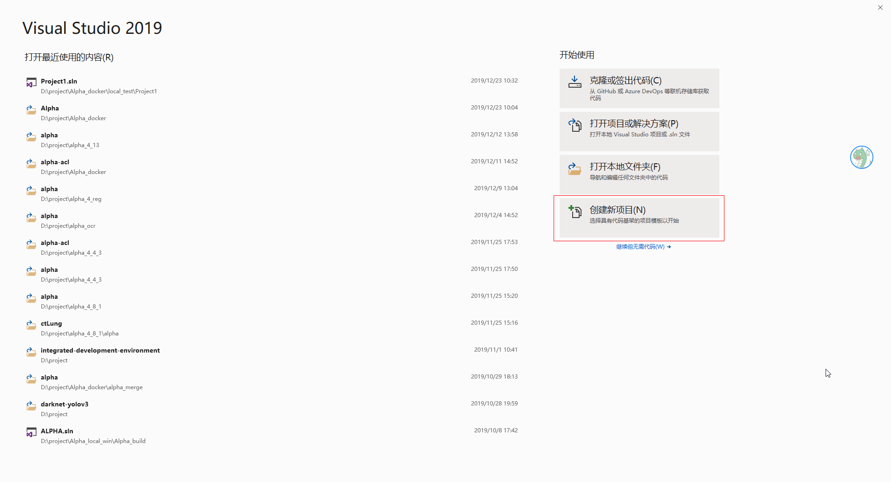
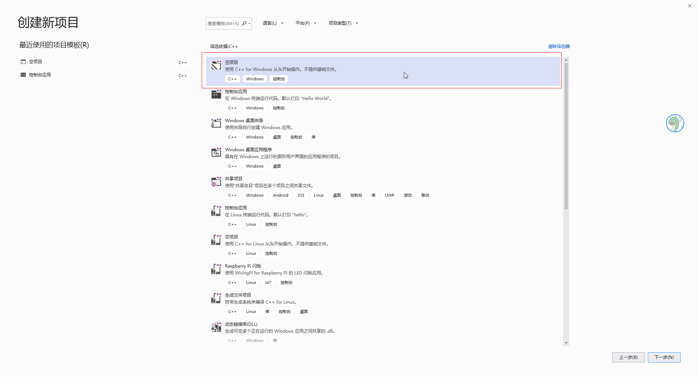
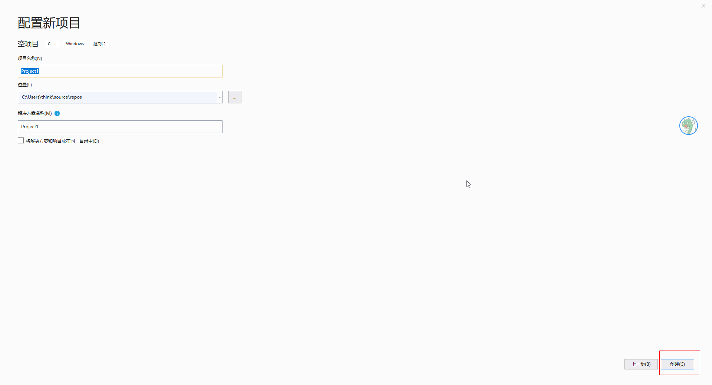

# 1 引言
## 1.1 目的和范围
在Windows 10操作系统使用Visual Studio 2019，进行c++工程开发。

## 1.2 文档约定

# 3 项目开发
## 3.1 创建工程
1. 打开VS2019程序，选择创建新项目，如下图所示。

2. 选择空项目，如下图所示

3. 设置工程和项目名，如下图所示

## 3.2 代码开发
1. 环境配置（参考“Windows操作系统SSH远程linux直接开发”文档）

## 3.3 项目debug
1. 设置为启动项目（参考“Windows操作系统SSH远程linux直接开发”文档）

# 5 参考文档

