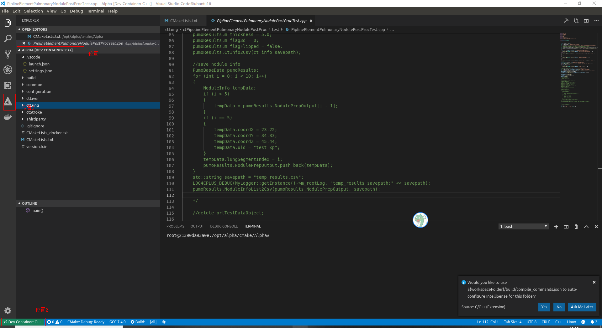

# 1. 引言
## 1.1 目的和范围
将当前ALPHA工程，在docker的contanier环境下进行开发。

## 1.2 文档约定


# 2. remote_contanier 基于docker-compose的设置方法
## 2.1 环境配置
1. 在linux环境下安装Visual Studio Code
2. 直接打开终端，运行代码，打开vscode：
```
code
```
3. 在Extensions模块下安装：
- Remote-Containers
- Docker

## 2.2 工程配置
1. 编写'docker-compose.yml'文件及相关images准备
```bash
version: '2.4'
services:
  cpp_build_env:
    image: cpp_build_env:0.1
    restart: always
    environment:
      - LANG=C.UTF-8
    security_opt:
      - seccomp:unconfined
    container_name: alpha_cpp_build
    volumes:
      - /etc/localtime:/etc/localtime:ro
      - /home/alpha_cpp/cmake:/opt/alpha/cmake
      - /home:/opt/alpha/host
    network_mode:
      bridge
    shm_size: 16G
    mem_limit: 20G
```
备注：[为了能够在container内部使用gdb进行调试，需要进行security设置](https://blog.csdn.net/so_dota_so/article/details/77509530)

2. 编写配置文件'.devcontainer\devcontainer.json'
```cpp
{
	"name": "C++",                                //指定Dev Container的名字
	"dockerComposeFile": "../docker-compose.yml", //指定docker-compose文件
	"service": "cpp_build_env",                   //指定docker-compose用的service
	"workspaceFolder": "/opt/alpha/cmake/Alpha",  //指定默认进入container内部的目录
	"remote.containers.defaultExtensions": [      //指定进入container内部后默认安装的extensions
		"vector-of-bool.cmake-tools",
		"twxs.cmake",
		"ms-vscode.cpptools"
	],
	"settings": {
		"terminal.integrated.shell.linux": "/bin/bash"
	},
	"shutdownAction": "stopCompose",             //设置退出时的操作"none"
}
```
## 2.3 工程启动
1. 打开工程：在vscode中打开linux下的工程配置目录
2. 进入container：“Ctrl+Shift+p”，选择“Remote-Containers:Reopen Folder in Container”，直接进入container内部，并打开文件夹“/opt/alpha/cmake/Alpha”，结果如下：

注意事项如下：
- 位置1：文件夹“/opt/alpha/cmake/Alpha”
- 位置2：显示为“Dev Container C++”，即为当前dev container名字
- 位置3：CMake标识，标识当前在docker内部加载了cmake相关的extensions
3. 生成库文件：
- “Ctrl+Shift+p”，选择执行cmake configure，完成cmake的配置；
- F7 完成代码编译和生成；
4. Debug：在相关位置下断点，直接F5进行代码调试（使用debug模式）

## 2.4 工程关闭
1. 点击2.3图片的位置2，选择“Close Remote Connection”

 
# 3. 参考文件：
>[vscode官方remote-container配置资料](https://github.com/microsoft/vscode-docs/blob/master/docs/remote/containers.md)
