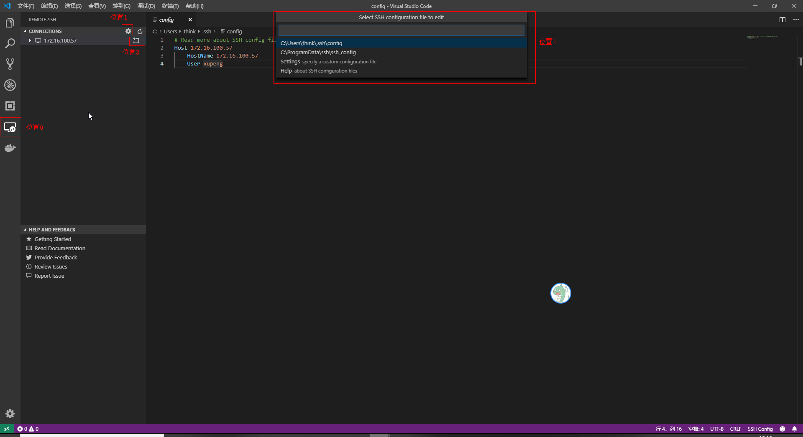

# 1. 引言
## 1.1 目的和范围
将当前ALPHA工程，远程ssh进行开发，分为直接在linux本地和docker两种情况。

## 1.2 文档约定


# 2. remote_ssh 基于linux本地的设置方法
## 2.1 环境配置
### 2.1.1 Visual Studio Code安装
在windows端安装Visual Studio Code，并添加扩展“Remote - SSH”
### 2.1.2 配置密钥对直接登录ssh
1. 本地win10生成密钥对
```bash
# win10以下版本需要自行提前安装ssh服务
# 默认路径
ssh-keygen -t rsa -b 4096
# 指定路径：C:\DevEnv\conf\ssh
ssh-keygen -t rsa -b 4096 -f C:\DevEnv\conf\ssh\id_rsa
```
2.  远程Linux主机配置：上传生成的密钥对(id_rsa和id_rsa.pub)到Linux的相应用户下，执行：
```bash
# 我这里的服务器ip是 172.16.100.57
ssh-copy-id -i id_rsa.pub 172.16.100.57
```
3. 验证是否配置成功：在密钥存放的路径打开终端，然后执行如下代码
```bash
ssh xupeng@172.16.100.57 -i ./id_rsa
#可以在不输入密码情况下ssh进入linux服务器
```
## 2.2 工程配置
### 2.2.1 ssh连接

- 步骤1：点击位置0的远程图标；
- 步骤2：点击位置1的设置图标；
- 步骤3：选择当前windows系统路径下“.ssh”目录下创建config文件（默认选择位置2的第一个），进行如下配置：
```bash
# Read more about SSH config files: https://linux.die.net/man/5/ssh_config
Host 172.16.100.57
    HostName 172.16.100.57
    User xupeng
```
- 步骤4：连接进入remote端，点击位置3的图标

### 2.2.2 配置remote扩展
在remote扩展模块安装以下扩展：
- C/C++
- CMake
- CMake Tools

## 2.3 工程启动
0. 准备相关代码
1. 打开工程文件夹：选择“文件(F)/打开文件夹”，选择相应的工程文件夹；
2. config CMake工程：按住“Ctrl+Shift+p”，选择“CMake:Configure”
3. build: F7 执行
4. 断点调试：下断点之后，F5 执行

## 2.4 工程关闭
直接关闭即可

# 3. remote_ssh 基于linux环境的docker的设置方法
## 3.1 环境配置 - ssh密码登录
1. 准备docker镜像：默认安装以下必备材料
- ALPHA相关库文件和头文件；
- ssh服务（apt-get install openssh-server）
- gdb服务（apt-get install gdb gdbserver）
2. docker-compose.yml文件配置
```bash
version: '2.4'
services:
  cpp_build_env:
    image: ffrct:1.0
    restart: always
    environment:
      - LANG=C.UTF-8
    ports:                             #需要将ssh的22端口号映射出来
      - "101:22"
    security_opt:                      #保证可以正常使用gdb调试
      - seccomp:unconfined
    container_name: alpha_cpp_build
    volumes:
      - /etc/localtime:/etc/localtime:ro
      - /home/alpha_cpp/cmake:/opt/alpha/cmake
      - /home:/opt/alpha/host
    network_mode:
      bridge
    shm_size: 16G
    mem_limit: 20G
```
3. 启动docker生成container：
```bash
docker-compose up -d                 #生成container在后台运行
docker exec -it alpha_cpp_build bash #进入container内部
```
4. 修改container内部配置：
- 设置container用户root的密码：
```
passwd 123456
```
- 配置ssh远程登录：修改/etc/ssh/sshd_config文件中PermitRootLogin的值为yes
- 重启ssh服务：
```
service ssh restart
```
5. 验证：在windows的cmd下运行
```bash
ssh root@172.16.100.57 -p 101   #登录密码：上面步骤4设置的123456
```
## 3.2 环境配置 - ssh密钥登录
1. 添加公钥到root配置文件
```bash
# 1. 在docker内部将公钥添加到系统文件
cat id_rsa.pub >> /root/.ssh/authorized_keys
# 2. 修改文件权限
chmod 700 /root/.ssh
chmod 600 /root/.ssh/*
# 备注：以上两步理论上可以使用“ssh-copy-id -i id_rsa.pub 172.16.100.57”一次解决，但是出现permission问题，无法通过
```
2. 测试是否成功：在windows端直接cmd运行
```
ssh root@172.16.100.57 -p 101 -i ./id_rsa
```
## 3.3 工程配置
参考步骤[2.2](#2.2-工程配置)，只是需要将2.2.1的步骤3的config文件改为：
```bash
# Read more about SSH config files: https://linux.die.net/man/5/ssh_config
Host 172.16.100.57
    HostName 172.16.100.57
    User root
    IdentityFile C:\Users\think\.ssh\id_rsa
    Port 101
```
## 3.4 工程启动
参考步骤[2.3](#2.3-工程启动)

## 3.5 工程关闭
参考步骤[2.4](#2.4-工程关闭)

# 4. 参考文件
1. [官方remote-ssh教程](https://code.visualstudio.com/docs/remote/ssh)
2. [远程开发环境搭建 Visual Studio Code + Remote-SSH](https://blog.csdn.net/u013475983/article/details/91861437)
